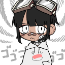

#  Gitarawoo 
Discord blind test bot for ChronoDream & co

# Environment variables
| Variable name | Description |
|---|---|
| GKEY | Google API key, necessary to fetch tracks on youtube API |
| TOKEN | Discord token |
| SHEET_ID | Blind test sheet ID on google sheets |

# Commands
| Command name | Description |
|---|---|
| ping | Test command |
| diagnostic | Checks the blind test sheet for dead links |
| challenge | One-shot challenge as a proof of concept |

# Data structure
The google sheet must contain a sheet named `InternalData`
The following column names are expected :

| name | gameName | location | series | difficulty | original | composer | interpret | platform | year | developer | publisher | continent | country | submitter | createTime | buyOn | videoID |
| - | - | - | - | - | - | - | - | - | - | - | - | - | - | - | - | - | - | 
